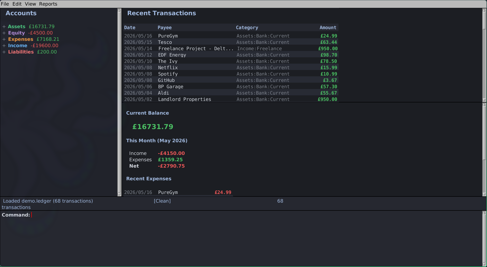

# Quaestor

A desktop personal finance manager built with [McCLIM](https://mcclim.common-lisp.dev/), the Common Lisp Interface Manager. Reads, displays, and writes [ledger-cli](https://ledger-cli.org/) compatible `.ledger` files.




## Features

- **Dashboard** - current balance, monthly income/expense summary, recent transactions at a glance
- **Account tree** - collapsible, colour-coded by type (assets, liabilities, income, expenses, equity)
- **Transaction list** - zebra-striped rows, sortable, filterable by account, date range, month/year
- **Balance & register reports** - equivalent to `ledger bal` and `ledger reg`
- **Dark mode** - full dark colour palette with themed panes
- **ledger-cli compatible** - reads and writes standard `.ledger` format; works alongside `ledger`, `hledger`, etc.
- **Keyboard-driven** - CLIM interactor for command entry, plus menu bar and mouse interaction

## Requirements

- **SBCL** (recommended) or **ECL**
- **Quicklisp** with the following systems available:
  - `mcclim`
  - `local-time`
  - `cl-ppcre`
  - `alexandria`
  - `closer-mop`
- **just** (command runner) — optional, for convenience recipes

## Quick Start

```sh
# Clone
git clone https://github.com/parenworks/quaestor.git
cd quaestor

# Build (requires SBCL + Quicklisp)
just build

# Run
just run-bin
```

Or load interactively in a REPL:

```lisp
(ql:quickload :quaestor)
(quaestor:main)
```

## Configuration

Settings are stored in `~/.config/quaestor/config.sexp`:

```lisp
(:default-file "/home/you/Finance/personal.ledger"
 :default-commodity "GBP"
 :commodity-symbol "£"
 :alignment-column 52
 :auto-save-interval 300
 :window-width 1200
 :window-height 800
 :recent-files ("/home/you/Finance/personal.ledger"))
```

## Build Recipes

| Command | Description |
|---------|-------------|
| `just build` | Build with SBCL (compressed binary) |
| `just build-ecl` | Build with ECL (native compiled) |
| `just run` | Run from source (no build needed) |
| `just run-bin` | Run the built binary |
| `just repl` | Load into SBCL REPL for development |
| `just test` | Run test suite |
| `just balance` | Print balance report to terminal |
| `just install` | Install binary to `/usr/local/bin` |
| `just clean` | Remove build artifacts |

## Ledger File Compatibility

Quaestor targets compatibility with ledger-cli and hledger file formats:

- Account directives with notes
- Transaction dates (primary and auxiliary)
- Cleared (`*`), pending (`!`), and unmarked states
- Comments (`;`) on transactions and postings
- Tags in comments
- Commodity declarations
- Amounts with commodity symbols (prefix or suffix)
- Elided amounts (auto-balanced postings)

## Architecture

```text
src/
├── package.lisp      # Package definition
├── conditions.lisp   # Custom condition types
├── mop.lisp          # MOP metaclass for auditable objects
├── model.lisp        # CLOS domain model (ledger, account, transaction, posting, amount)
├── parser.lisp       # .ledger file reader
├── writer.lisp       # .ledger file writer
├── engine.lisp       # Business logic (filtering, balance/register reports, validation)
├── presentations.lisp # CLIM presentation types
├── frame.lisp        # Application frame, panes, display functions
├── commands.lisp     # CLIM commands (file, edit, view, reports)
└── main.lisp         # Entry point
```

## License

MIT
